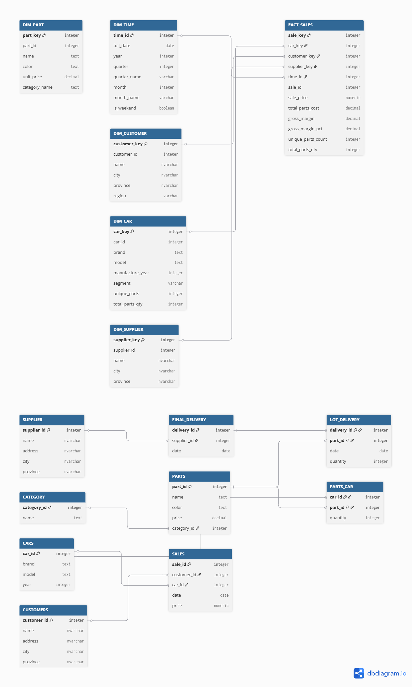

# Car Manufacturing Supply Control — Data Engineering Project


An end-to-end Data Engineering portfolio project built on Snowflake. Transforms a transactional (OLTP) car manufacturing database into a fully modelled analytical data warehouse using the **Medallion Architecture** (Bronze → Silver → Gold) and **Kimball's Star Schema** principles.



---

## Skills demonstrated

| Skill | Implementation |
|-------|---------------|
| Data modelling — Star Schema | `04_gold/ddl_dimensions.sql`, `04_gold/ddl_fact.sql` |
| Data structuring — DDL, types, constraints | `01_source_schema/ddl_source.sql` |
| ETL / ELT — MERGE, window functions, CTEs | `04_gold/etl_load_gold.sql` |
| Data quality — assertion checks, NULL handling | `03_silver/quality_checks_and_staging.sql` |
| Data management — dictionary, lineage, business rules | `docs/data_dictionary.md` |
| Analytical SQL — views, LAG, PARTITION BY | `05_reporting/views.sql` |
| Snowflake-native — GENERATOR, AUTOINCREMENT, MERGE | Throughout |

---

## Architecture

```
┌─────────────────────────────────────────────────────────────────┐
│  SOURCE schema (OLTP)                                           │
│  SUPPLIER · FINAL_DELIVERY · LOT_DELIVERY · PARTS · CATEGORY   │
│  CARS · PARTS_CAR · CUSTOMERS · SALES                          │
└───────────────────────┬─────────────────────────────────────────┘
                        │ Silver views (rename, cast, QC checks)
┌───────────────────────▼─────────────────────────────────────────┐
│  SILVER schema (Staging)                                        │
│  STG_SUPPLIER · STG_CUSTOMERS · STG_CARS · STG_PARTS           │
│  STG_SALES · STG_PARTS_CAR · STG_FINAL_DELIVERY                │
└───────────────────────┬─────────────────────────────────────────┘
                        │ MERGE (idempotent ETL)
┌───────────────────────▼─────────────────────────────────────────┐
│  GOLD schema (Star Schema)                                      │
│  DIM_TIME · DIM_CAR · DIM_CUSTOMER · DIM_SUPPLIER · DIM_PART   │
│                      FACT_SALES                                 │
└───────────────────────┬─────────────────────────────────────────┘
                        │ Analytical views
┌───────────────────────▼─────────────────────────────────────────┐
│  REPORTING schema                                               │
│  RPT_REVENUE_BY_BRAND · RPT_SALES_BY_REGION                    │
│  RPT_MODEL_PROFITABILITY · RPT_SUPPLIER_PERFORMANCE            │
│  RPT_MONTHLY_TREND · RPT_PARTS_COST_BY_SEGMENT                 │
└─────────────────────────────────────────────────────────────────┘
```

---

## Project structure

```
car-manufacturing-de-project/
├── README.md
├── 01_source_schema/
│   └── ddl_source.sql                   Original 8 OLTP tables
├── 02_bronze/
│   └── seed_data.sql                    Sample data (30 sales, 20 parts, 10 cars)
├── 03_silver/
│   └── quality_checks_and_staging.sql   6 QC checks + 8 staging views
├── 04_gold/
│   ├── ddl_dimensions.sql               DIM_TIME, DIM_CAR, DIM_CUSTOMER, DIM_SUPPLIER, DIM_PART
│   ├── ddl_fact.sql                     FACT_SALES
│   └── etl_load_gold.sql                MERGE-based load: Silver → Gold
├── 05_reporting/
│   └── views.sql                        6 analytical views
└── docs/
    ├── data_dictionary.md               Field definitions, business rules, lineage
    └── dbdiagram_schema.dbml            Schema for dbdiagram.io visualization
```

---

## How to run

You need a Snowflake account (the [30-day free trial](https://signup.snowflake.com/) works). Execute the scripts in order inside a Snowflake worksheet:

```sql
-- Step 1 — Create source schema and OLTP tables
-- Run: 01_source_schema/ddl_source.sql

-- Step 2 — Load sample data into source tables
-- Run: 02_bronze/seed_data.sql

-- Step 3 — Run data quality checks (all queries should return 0 failures)
--          Then create Silver staging views
-- Run: 03_silver/quality_checks_and_staging.sql

-- Step 4 — Create dimension tables and auto-generate DIM_TIME (2022–2025)
-- Run: 04_gold/ddl_dimensions.sql

-- Step 5 — Create FACT_SALES table
-- Run: 04_gold/ddl_fact.sql

-- Step 6 — Load dimensions and fact via idempotent MERGE statements
-- Run: 04_gold/etl_load_gold.sql

-- Step 7 — Create reporting views
-- Run: 05_reporting/views.sql

-- Step 8 — Query the reporting layer
SELECT * FROM CAR_MANUFACTURING_DB.REPORTING.RPT_REVENUE_BY_BRAND;
SELECT * FROM CAR_MANUFACTURING_DB.REPORTING.RPT_MODEL_PROFITABILITY ORDER BY avg_margin_pct DESC;
SELECT * FROM CAR_MANUFACTURING_DB.REPORTING.RPT_MONTHLY_TREND;
```

---

## Sample queries

```sql
-- Top 3 most profitable car models
SELECT brand_model, avg_margin_pct, units_sold, total_gross_margin
FROM CAR_MANUFACTURING_DB.REPORTING.RPT_MODEL_PROFITABILITY
ORDER BY avg_margin_pct DESC
LIMIT 3;

-- Month-over-month revenue growth in 2023
SELECT year_month, total_revenue, mom_revenue_growth_pct
FROM CAR_MANUFACTURING_DB.REPORTING.RPT_MONTHLY_TREND
WHERE year = 2023
ORDER BY month;

-- Revenue breakdown by region
SELECT region, SUM(total_revenue) AS revenue
FROM CAR_MANUFACTURING_DB.REPORTING.RPT_SALES_BY_REGION
GROUP BY region
ORDER BY revenue DESC;
```

---

## Key design decisions

**Surrogate keys over natural keys** — All dimension tables use `AUTOINCREMENT` surrogate keys, decoupling the warehouse from source system ID changes and enabling SCD patterns.

**MERGE for idempotency** — All Gold loads use `MERGE INTO ... USING ... ON ...` so every script can be re-run safely without creating duplicates — a production-grade ETL requirement.

**DIM_TIME generated, not derived** — The date dimension is pre-populated using Snowflake's `GENERATOR` function, ensuring every date exists in the dimension even if no sales occurred on that day.

**Silver as views** — The Silver layer uses `CREATE OR REPLACE VIEW` rather than materialised tables, keeping storage minimal while ensuring Silver always reflects the latest source data. In a high-volume production pipeline this would switch to Dynamic Tables.

**Gross margin pre-computed in fact** — `gross_margin` and `gross_margin_pct` are stored as measures in the fact table rather than computed at query time, following Kimball's convention for additive measures.

**Supplier resolved via latest delivery** — Since there is no direct FK between SALES and SUPPLIER in the source schema, the ETL uses `ROW_NUMBER() OVER (PARTITION BY sale_id ORDER BY delivery_date DESC)` to link each sale to the most recent prior delivery — a common real-world data linkage pattern.

---

## Technologies


- **Snowflake** — Cloud data warehouse. All SQL uses Snowflake dialect.
- **SQL** — DDL, DML, window functions (`LAG`, `ROW_NUMBER`, `PARTITION BY`), CTEs, MERGE
- **Kimball dimensional modelling** — Star schema, surrogate keys, SCD Type 1
- **Medallion architecture** — Bronze / Silver / Gold data layering

---

## Author

**Sergi de la Cruz Núñez**  
[LinkedIn]((https://www.linkedin.com/in/sergi-de-la-cruz-905543257/)) · [your@email.com](mailto:sergidelacruz1994@gmail.com)

---

## Possible extensions

- Add a **Snowflake Task** to schedule the ETL on a daily cron
- Implement **Snowflake Streams** for CDC (Change Data Capture) instead of full MERGE loads
- Add **SCD Type 2** to `DIM_CUSTOMER` to track address changes over time
- Connect a **Streamlit in Snowflake** dashboard on top of the reporting views
